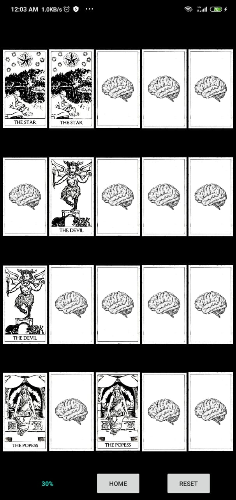

# NavigationAndMenu

Borrador de un juego que te permite ejercitar tu mente.
Usando dos maquinas para ejercitar, MEMORIAG y SECUENCIAS, si superas completamente las dos maquinas obtendras un puntaje de 100% para cada maquina y en gran visualizacion el promedio de los dos puntajes individuales.

Una vez alcanzas el objetivo pasado cierto tiempo el porcentaje global empezará a disminuir, indicando quie debes seguir ejercitandote.

Video de funcionamiento
https://drive.google.com/file/d/14uwl4-4pAoBhX6jHXizfZY5QHY79qdzq/view?usp=drivesdk

